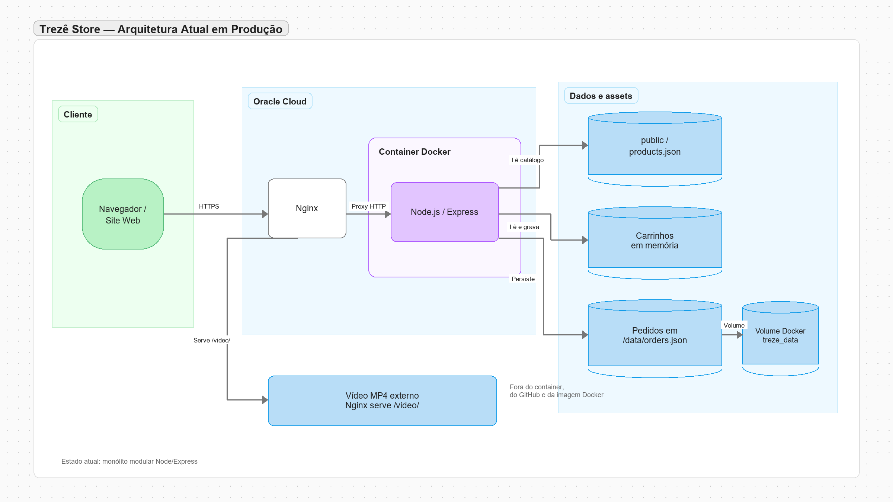
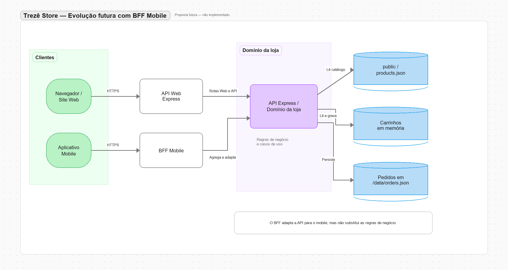

# Trezê Store

E-commerce de objetos autorais impressos em 3D. O projeto nasceu para o desafio do Bootcamp AI/R — Trilha Commerce e foi estruturado para ser simples de explicar, rápido de executar e preparado para crescer.

## Stack

- Node.js 20+
- Express 5
- HTML, CSS e JavaScript nativos no frontend
- `products.json` como catálogo desacoplado da interface
- Imagens de produtos fornecidas pelo usuário, copiadas para `public/assets/images/products/`
- Fallback SVG local para falhas ou ausência de uma imagem principal
- Node Test Runner para testes automatizados
- Helmet e Compression para hardening e transporte eficiente

## Executar localmente

```bash
npm install
npm test
npm start
```

Depois, abra `http://127.0.0.1:3000`.

Para desenvolvimento com reinício automático:

```bash
npm run dev
```

## Estrutura

```text
src/
├── app.js                         # composição do Express
├── server.js                      # processo HTTP e encerramento seguro
├── config/env.js                  # configuração por ambiente
├── controllers/                  # entrada HTTP e respostas
├── middlewares/                  # erros e recursos transversais
├── models/                        # entidades e invariantes do domínio
│   ├── cart.model.js
│   ├── order.model.js
│   └── product.model.js
├── repositories/                 # acesso ao catálogo e aos carrinhos
├── routes/                        # definição das rotas da API
└── services/                      # regras de negócio, incluindo o carrinho

public/
├── index.html                     # vitrine
├── produto.html                   # detalhe do produto
├── carrinho.html                  # carrinho demonstrativo
├── checkout.html                  # revisão e confirmação do pedido
├── pedido.html                    # visualização de pedido confirmado
├── pedidos.html                   # histórico de pedidos da sessão
├── products.json                  # catálogo consumido via fetch
├── como-fiz/index.html            # página técnica do desafio
└── assets/
    ├── css/styles.css             # tokens, componentes e responsividade
    ├── images/                    # imagens e fallbacks locais do catálogo
    └── js/                        # módulos de catálogo, site e carrinho

test/
├── app.test.js
├── cart.service.test.js
├── models.test.js
├── order.service.test.js
├── product.repository.test.js
└── product.service.test.js

Dockerfile                          # imagem de produção
compose.yaml                        # execução na Oracle Cloud
.dockerignore                       # arquivos fora da imagem
.github/workflows/ci-cd.yml         # testes, build, publicação e deploy
docs/deploy-oracle.md               # setup Ubuntu 24.04 e secrets
diagramas/                          # arquitetura atual e evolução com BFF
```

## Decisões de arquitetura

### MVC modular

O Express atua como camada HTTP. Controllers interpretam requisições, services
coordenam casos de uso, models representam entidades e invariantes do domínio e
repositories isolam o acesso aos dados. O fluxo principal é
`route → controller → service → model/repository`, mantendo cada parte pequena e
permitindo trocar o armazenamento sem reescrever as rotas.

### Catálogo desacoplado

A vitrine carrega `/products.json` via `fetch`, conforme o requisito do bootcamp. A API também expõe os produtos em `/api/products` para uma evolução futura, sem obrigar o frontend atual a depender dela.

### Performance por padrão

- HTML, CSS, JavaScript e imagens ficam como assets estáticos.
- Imagens dos cards usam `loading="lazy"`.
- SVGs locais evitam chamadas externas para o catálogo.
- Express aplica compressão HTTP.
- ETag e cache controlam revalidação de arquivos.
- O Node não faz processamento pesado de renderização por requisição.
- O frontend não exige bundler para a primeira versão, reduzindo complexidade operacional.

### Escalabilidade progressiva

A aplicação pode ser publicada em uma instância Oracle Cloud atrás de Nginx ou Caddy. Em uma etapa posterior, os assets estáticos podem ir para um bucket/CDN e o Node permanecer responsável pelas rotas e APIs.

### Diagramas de arquitetura

Os diagramas da pasta `diagramas/` ajudam a visualizar como a loja funciona e
como ela poderia evoluir. Eles complementam a explicação do projeto, mas não
representam funcionalidades além do que está descrito aqui.

Na arquitetura atual, o navegador acessa a aplicação por HTTPS. O Nginx recebe
as requisições e encaminha a aplicação para o container Docker, onde roda o
Node.js com Express. O catálogo é lido de `public/products.json`, os carrinhos
ficam em memória e os pedidos são gravados em `/data/orders.json`. Esse arquivo
fica protegido pelo volume Docker `treze_data`, por isso os pedidos continuam
disponíveis depois que o container é recriado.

O vídeo da página `/como-fiz` segue um caminho separado: ele fica fora do
container e do GitHub, armazenado na Oracle e servido diretamente pelo Nginx.
Assim, o arquivo pesado não participa do build da imagem nem do histórico do
Git.

O diagrama com BFF mostra uma evolução futura, ainda não implementada. Caso a
loja ganhe um aplicativo mobile, o app poderia conversar com um BFF específico.
Essa camada agregaria e adaptaria respostas para o mobile, enquanto o site web
continuaria usando sua API e as regras de negócio permaneceriam no domínio
principal da aplicação. O BFF não substituiria controllers, services, models ou
repositories; ele apenas funcionaria como uma interface adequada para outro
canal.





## Rotas principais

- `GET /` — vitrine
- `GET /produto.html?id=castical-orbita` — detalhe de produto
- `GET /carrinho.html` — carrinho local demonstrativo
- `GET /checkout.html` — checkout com revisão e confirmação do pedido
- `GET /pedido.html?id=<orderId>` — visualização de um pedido confirmado
- `GET /pedidos.html` — histórico local de pedidos
- `GET /como-fiz` — página técnica
- `GET /products.json` — catálogo público usado pelo frontend
- `GET /api/health` — health check
- `GET /api/products` — catálogo pela API, com `search` e `category` opcionais
- `GET /api/products/:id` — produto individual
- `POST /api/carts` — cria um carrinho
- `GET /api/carts/:cartId` — consulta o carrinho e seus totais
- `POST /api/carts/:cartId/items` — adiciona produto ao carrinho
- `PATCH /api/carts/:cartId/items/:productId` — atualiza a quantidade
- `DELETE /api/carts/:cartId/items/:productId` — remove um item
- `DELETE /api/carts/:cartId` — limpa o carrinho
- `POST /api/orders` — confirma um pedido a partir do carrinho
- `GET /api/orders/:orderId` — consulta o pedido confirmado

### Carrinho

O carrinho segue uma API REST pequena e previsível. O frontend salva apenas o
`cartId` e usa o backend como fonte dos itens e dos totais. O `CartService`
valida se o produto existe no catálogo, limita cada item a 99 unidades e faz os
cálculos em centavos para evitar erros de arredondamento. Nesta primeira versão,
os carrinhos ficam em memória para manter o projeto simples; em produção, o
mesmo contrato pode ser conectado a Redis ou a um banco sem mudar a interface.

### Checkout

O checkout coleta somente nome, e-mail, telefone e uma observação opcional. Ao
confirmar, o `OrderService` cria um snapshot dos itens e valores do carrinho,
retorna um identificador de pedido e limpa o carrinho. Como o desafio pede um
checkout fictício, não há captura de cartão: entrega e pagamento ficam explícitos
como combinados diretamente com o cliente.

Depois da confirmação, o frontend registra até 20 IDs no histórico local e
oferece a página `/pedidos.html`. Cada registro consulta `GET /api/orders/:id`
para exibir os detalhes. Os pedidos são persistidos em `DATA_DIR/orders.json`
quando a aplicação roda em produção, usando o volume Docker `treze_data`.

### Docker e CI/CD

O repositório já está preparado para rodar em uma instância Ubuntu 24.04 na
Oracle Cloud. O `Dockerfile` gera uma imagem de produção com dependências
mínimas e usuário não-root, enquanto o `compose.yaml` configura reinício
automático e health check. O workflow `.github/workflows/ci-cd.yml` roda testes,
formatação e auditoria; em pushes para `main`, publica a imagem no GHCR e faz o
deploy por SSH na instância. O passo a passo está em
[`docs/deploy-oracle.md`](docs/deploy-oracle.md).

```bash
docker compose up -d
curl http://127.0.0.1:3000/api/health
```

## Qualidade

O comando `npm test` cobre:

- leitura e validação do catálogo;
- filtragem por categoria;
- busca sem diferenciação de acentos;
- categorias sem duplicidade e ordenadas;
- health check da aplicação.
- fluxo de checkout com snapshot do pedido e limpeza do carrinho;

O vídeo da apresentação técnica é um asset externo ao repositório. Em produção,
o Nginx o serve em `/video/testeVideo.mp4` a partir do armazenamento persistente
da Oracle, fora do container e do GitHub. Isso evita colocar arquivos grandes no
histórico Git e permite substituir o vídeo sem reconstruir a imagem.
